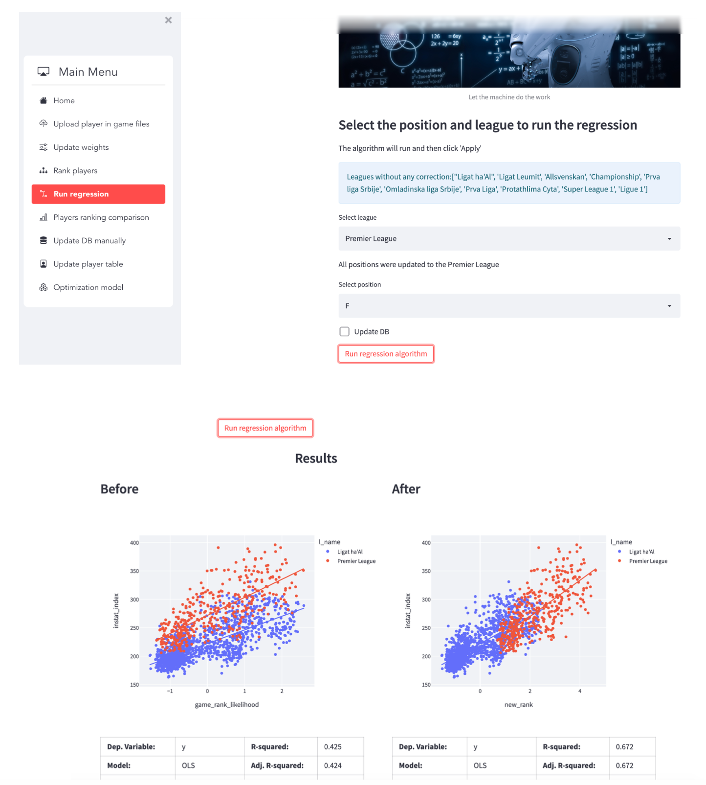

# opTEAMize
This project presents a solution to optimize the scouting process of a football club, particularly in the case of the Hapoel-Tel-Aviv football club in the Israeli Premier League. The objective is to create an optimization model that will analyze players' performance and consider the club's constraints to find the optimal squad for the club.

# Problem Statement
The scouting process of a football club is subjective and time-consuming, which can lead to different outputs depending on the analyst's insights. Additionally, frequent alternations of the squad's players imply challenging procurement settings, and the team's rank doesn't correlate with the club's expectations and budget. The input is not embedded enough to get enriched insights as an output.

# Solution
We created an optimization model that takes the club's internal and open-source external data as input, which is merged into a single DB. The model fuses the data and identifies each event's significance in a match, given the position in the field, using the BORUTA algorithm. The model concludes each significant event to create a sophisticated weight, computed by the BORUTA algorithm's output. Then, using a Bayesian ML model, we developed a method that adjusts the weights to correspond to the coaching staff's prior needs.

The model uses a scoring method to rank each player in each game according to the weights and incorporates an optimization model that considers financial and other constraints and professional scores. The model output is of the optimal team and other outcomes that will support the club's strategic decisions. Our model utilizes a simple UI to merge all the above capabilities into one compact and essential system.

# Features
<li> Fuses data to an autonomous DB</li>
<li> Identifies each event's significance in a match, given the position in the field</li>
<li> Concludes each significant event to create a sophisticated weight, computed by the BORUTA algorithm's output</li>
<li> Adjusts the weights to correspond to the coaching staff's prior needs using a Bayesian ML model</li>
<li> Ranks each player in each game according to the weights using a scoring method</li>

<li> Incorporates an optimization model that considers financial and other constraints and professional scores</li>
<li> Utilizes a simple UI to merge all the above capabilities into one compact and essential system</li>
